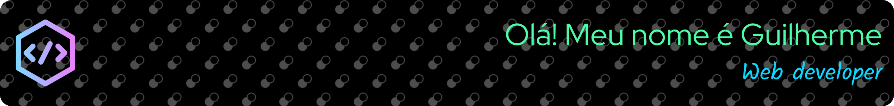

	

    

<h3 align="center" margin="5px">Será um prazer receber sua visita em meus perfis nas redes sociais:  It will be a pleasure to receive your visit on my profile on social networks:</h3>

	
       
	

<h4>
	🇧🇷️ Sobre mim:
</h4>

Tenho 25 anos e sou mineiro de Diamantina. Filho de um carpinteiro e de uma dona de casa, que me incentivaram a estudar desde cedo, decidi dedicar-me à computação por influência de meu irmão e permaneço no caminho do desenvolvimento de software, com o intuito de aperfeiçoar cada vez mais a qualidade de minhas aplicações e me tornar um desenvolvedor mais completo a cada oportunidade.

Sobre minha formação: sou técnico em informática, formado em 2014, e em 2022 me tornei bacharel em Sistemas de Informação pela Universidade Federal dos Vales do Jequitinhonha e Mucuri (UFVJM). Também possuo cursos e certificados, que podem ser acessados em: <a href="https://guilhermerocha.dev.br/index.php#certificados">https://guilhermerocha.dev.br/index.php#certificados</a>.

Atualmente trabalho no desenvolvimento web com as linguagens: <strong>HTML</strong>, <strong>CSS</strong> e <strong>JavaScript</strong>, as bibliotecas: <strong>Vanilla JS</strong> e <strong>JQuery</strong>, e com as plataformas de e-commerce: <strong>VTEX (IO e CMS)</strong>, <strong>Shopify</strong> e <strong>Loja Integrada</strong>. Contudo possuo conhecimento em <strong>PHP</strong>, <strong>SQL</strong>, <strong>React JS</strong>, <strong>Node JS</strong>, <strong>Bootstrap</strong> e outras tecnologias.

Para mais detalhes sobre mim, acesse <a href="https://guilhermerocha.dev.br/" target="_blank">meu portfólio</a>.

<h4>
    🇺🇲️ About me:
</h4>

    I'm 25 years old and I was born in Diamantina, a town located in Brazil. I'm son of a carpenter and a housewife, who encouraged me to study from an early age, and decided to dedicate to computing by influence of my older brother. I stay in the software development way, in order to improve more and more the quality of my applications and to become a most complete developer in each opportunity.

    About my education: I'm Computer Technician, graduated in 2014, and became a bachelor in Information Systems in 2022 from the Federal University of Jequitinhonha and Mucuri Valleys (UFVJM). I also have others certificates and courses in my curriculum, which can be accessed at: https://guilhermerocha.dev.br/index.php#certificados.

    At the moment, I work on web development with the languages: <strong>HTML</strong>, <strong>CSS</strong> and <strong>JavaScript</strong>, the libraries: <strong>Vanilla JS</strong> and <strong>JQuery</strong>, and with the ecommerce platforms: <strong>VTEX (IO and CMS)</strong>, <strong>Shopify</strong> and <strong>Loja Integrada</strong>. However I have knowledge of <strong>PHP</strong>, <strong>SQL</strong>, <strong>React JS</strong>, <strong>Node JS</strong>, <strong>Bootstrap</strong> and others technologies.

Visit <a target="_blank" href="https://guilhermerocha.dev.br/">my portfolio</a> for more details about me.

 

	<table width="100vh">
	    <thead>
            <tr>
                <th width=250>
                    <h4>
                        Habilidades e Virtudes: / Skills:
                    </h4>
                </th>
                <th width=250>
                    <h4>
                        Hobbies:
                    </h4>
                </th>
            </tr>
	    </thead>
	    <tbody>
            <tr>
                <td width=450>
                    <ul>
                        <li>👨🏻‍💻 Desenvolvimento de Software | Web / Software Development</li>
                        <li>📝 Comunicação Escrita / Written Communication</li>
                        <li>😃 Agradável e de Ótimo Relacionamento Interpessoal / Pleasant and Great Interpersonal Relationship</li>
                    </ul>
                </td>
                <td width=450>
                    <ul>
                        <li>🏃‍♂️ Correr / Go for a run</li>
                        <li>💻 Programar / Coding</li>
                        <li>🇬🇧 | 🇺🇸 Estudar Inglês / Study English</li>
                        <li>🎵 | 🎸 Música e Violão / Music and Acoustic Guitar</li>
                        <li>⚽ Futebol / Football</li>
                    </ul>
                </td>
            </tr>
	    </tbody>
	</table>

    <table width="100vw">
        <thead>
            <tr>
                <th>
                    <h4>Tecnologias / Technologies:</h4>
                </th>
                <th>
                    <h4>Atividade Semanal / Weekly Activity:</h4>
                </th>
            </tr>
        <thead>
        <tbody>
            <tr>
                <td width=450>
                    

                        <table align="center">
                            <tbody>
                                <tr>
                                    <td></td>
                                    <td></td>
                                    <td></td>
                                </tr>
                                <tr>
				    <td></td>
                                    <td></td>
                                    <td></td>
                                </tr>
                                <tr>
				    <td></td>
                                    <td></td>
                                    <td></td>
                                </tr>
                            </tbody>
                        </table>
                    

                </td>
                <td width=450>
                    

                        
                    

                </td>
            </tr>
        </tbody>
    </table>

    
    

<h4>Tempo total de codificação registrado pelo Wakatime: Development time registered by Wakatime:</h4>
	

